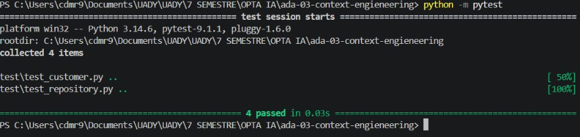
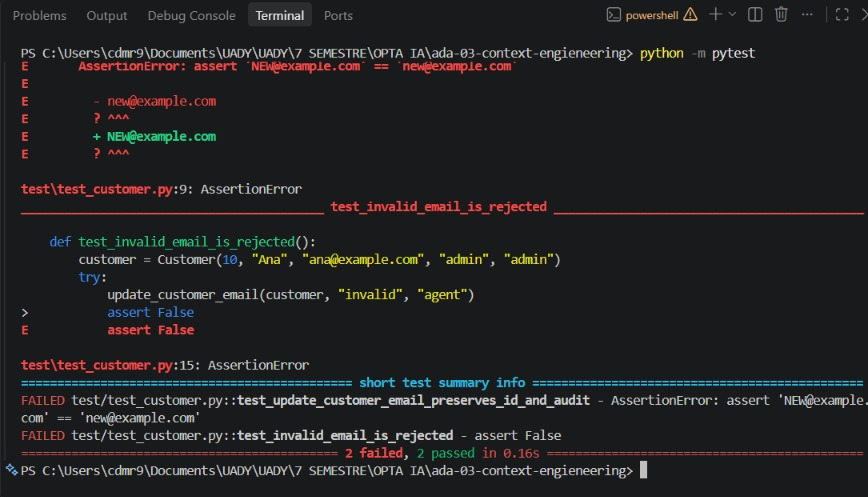

Customer API 
 
Small Python module for managing customer records. 
 
## Structure - src/customer.py: customer domain operations - src/repository.py: in-memory customer repository - tests/: automated tests 
 
## Run tests 
pytest

